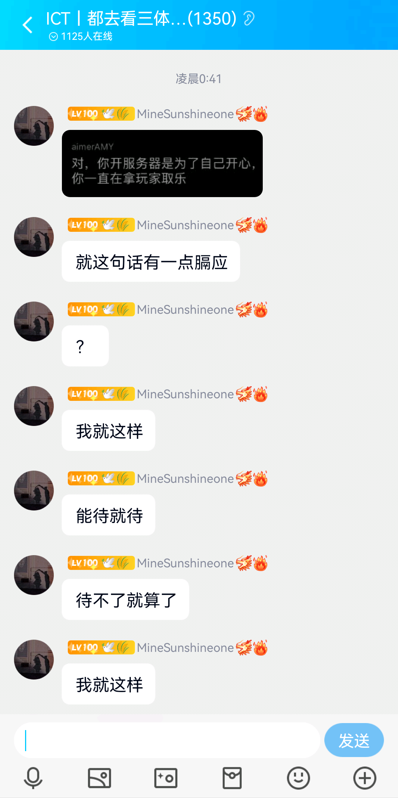
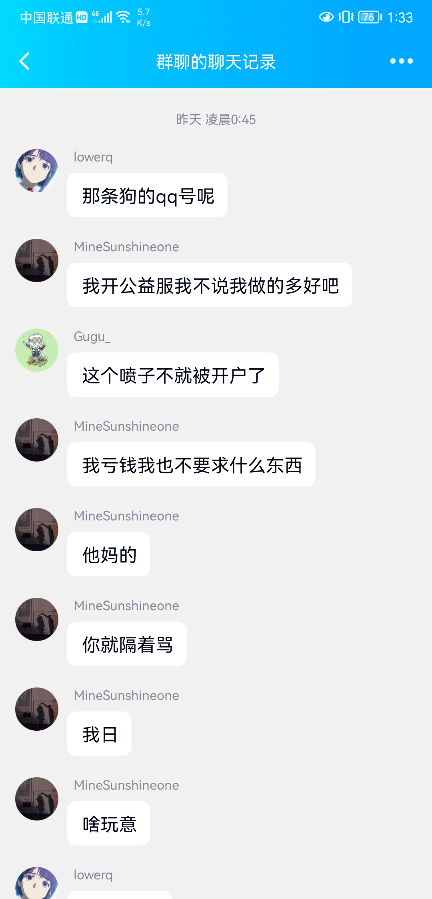
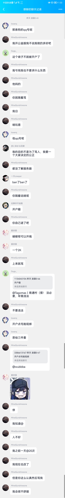
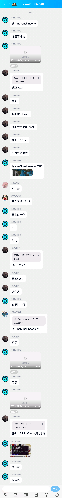
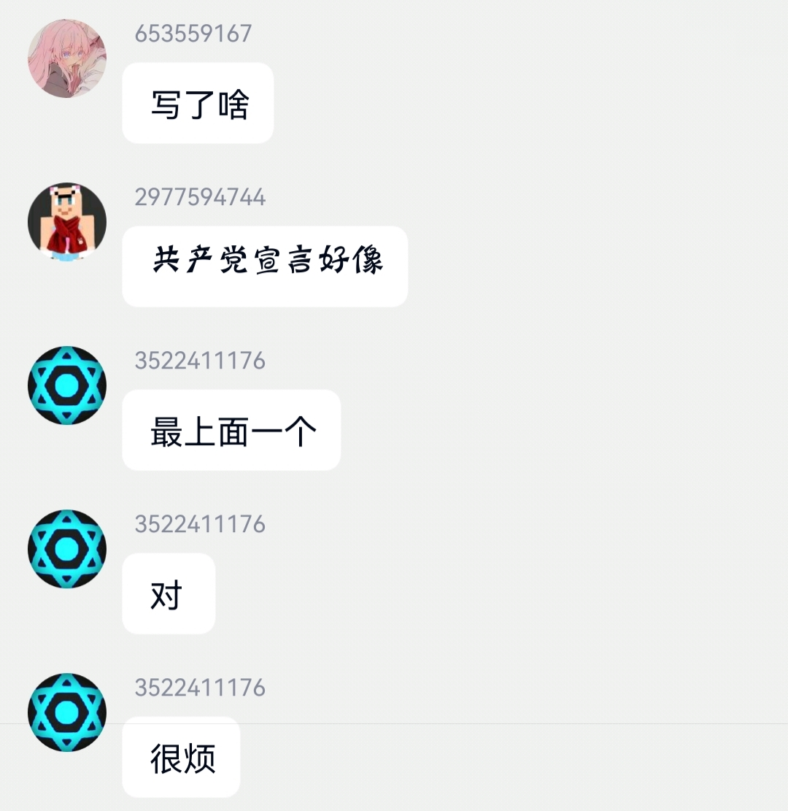
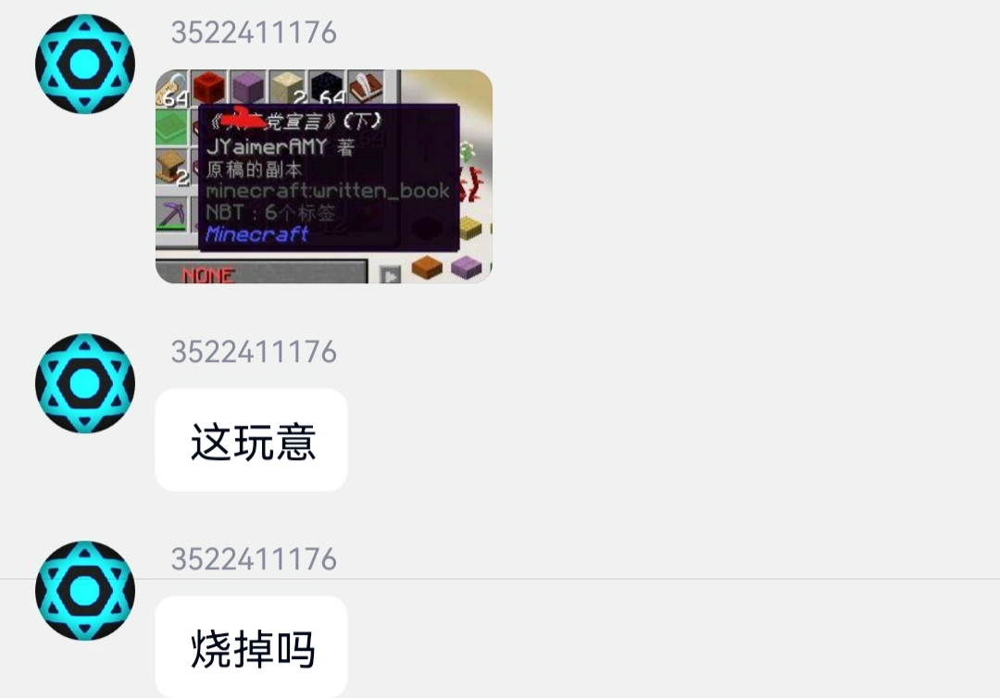

> [!NOTE]  
> 本文为[CV21420010](https://www.bilibili.com/read/cv21420010/
)中提及链接的[QQ文档](https://docs.qq.com/doc/DU1JOUGJqem5TWERw)备份，其作者言论不代表IsCharacterTriple项目组。

> "麦上皇的麦不仅是麦克阿瑟的麦，还是麦卡锡的麦🤣👉"
>
>  —— ICT事务对策委员会 群组聊天记录

# ICT服务器的猎奇环境与独裁者

此人是服主，随随便便tp玩家，禁言，ban玩家，时间不长，自称开玩笑，实则就是拿玩家取乐，天天在群里艾特全体成员说”打不打CSGO“，半夜十二点在群里艾特全体“服务器玩的怎么样”，如果服务器真的有更新，停服维护之类的大事件当然可以艾特全体，干扰玩家游戏体验，拿玩家取乐，开玩笑不经过别人同意，没有任何正当性

待不了就算了我就这样，这句话不仅坐实了他戏耍玩家，并且表现出毫无悔改之意，证明他做这些即使每次都有人不满，但还是没有感到任何愧疚

我只想要个公平，而他们却急成这个样子

公益服不意味着你就可以随便拿玩家取乐，这不单单是不负责的问题，这是道德问题了

况且这个玩家素质也不好评价，跟他们没有关系的事，反倒操心起来还要帮忙开户，可能招的人就是按服主自己的样子招的

这个时候我已经被禁言了，禁言了再骂，把别人嘴封住等于我赢了，有什么脸说改了啊，你还很自豪吗，任何一个服务器随随便便戏弄玩家也不可能是对的，这是道德问题

我在很多服务器都写过宣言，很多人很友善也很欢迎，因为这不是政治敏感内容，这种情况还是第一次遇见

"敏感话题通常是指 **非权威媒体发布的**[^1] 有关争议话题的消息，包括意识形态、政治、社会制度等方面的重大分歧等相关话题。电视节目中如果涉及到这类话题是非常被动和致命的，通常，这类舆情会在相关节目审片的时候就能提前被发现并做相应的调整。"节选自《[网络舆情监控机制的思考](http://gdj.zj.gov.cn/art/2020/1/6/art_1228991992_41467959.html)》

这是团子发的宣言，已经获得了63万播放量https://www.bilibili.com/video/BV1xW41177iT

**一个人，一个中国人，如此害怕宣言，如此害怕党**[^1][^2]

[^1]: 原文为红色字体。
[^2]: 原文在此戛然而止，但想要表达什么已经不言而喻了。
